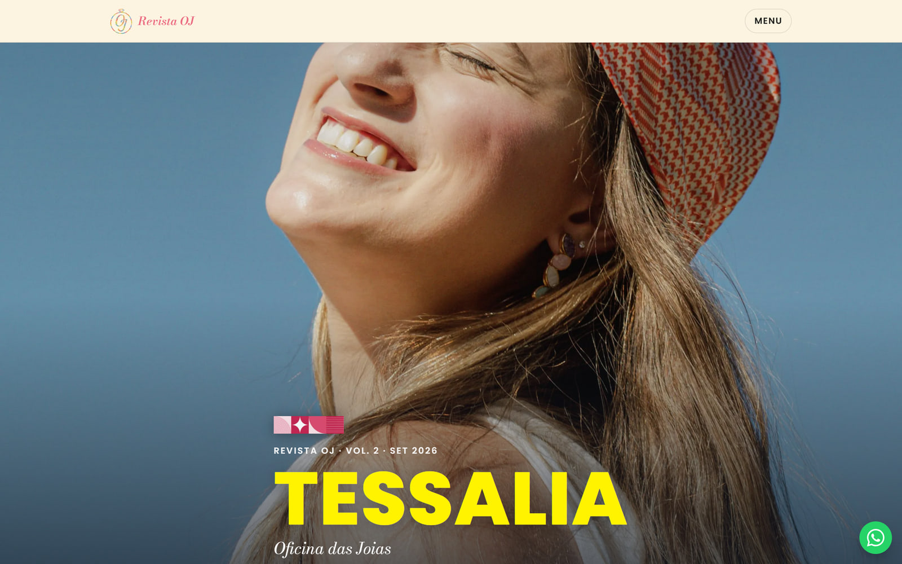
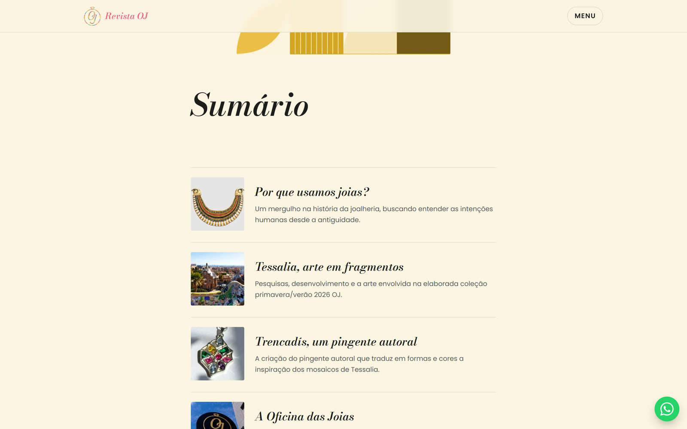
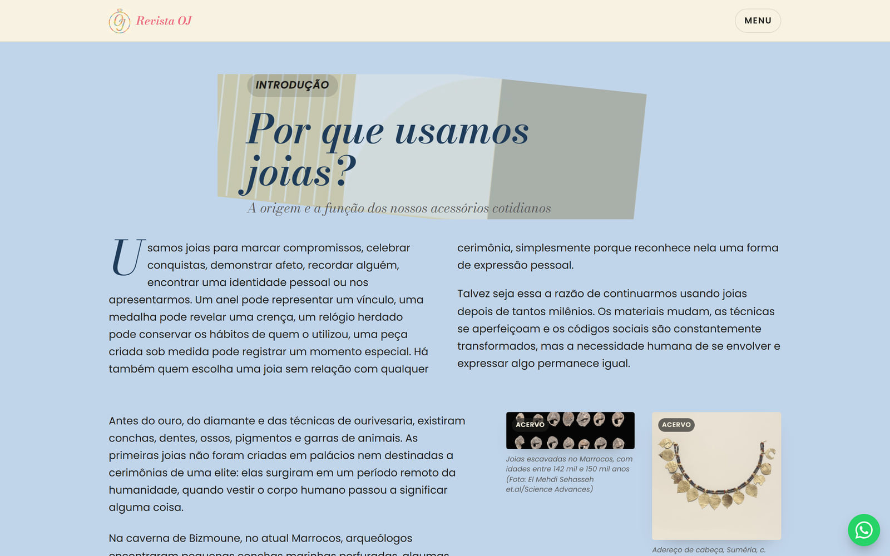
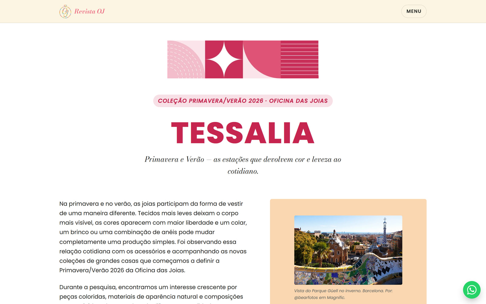
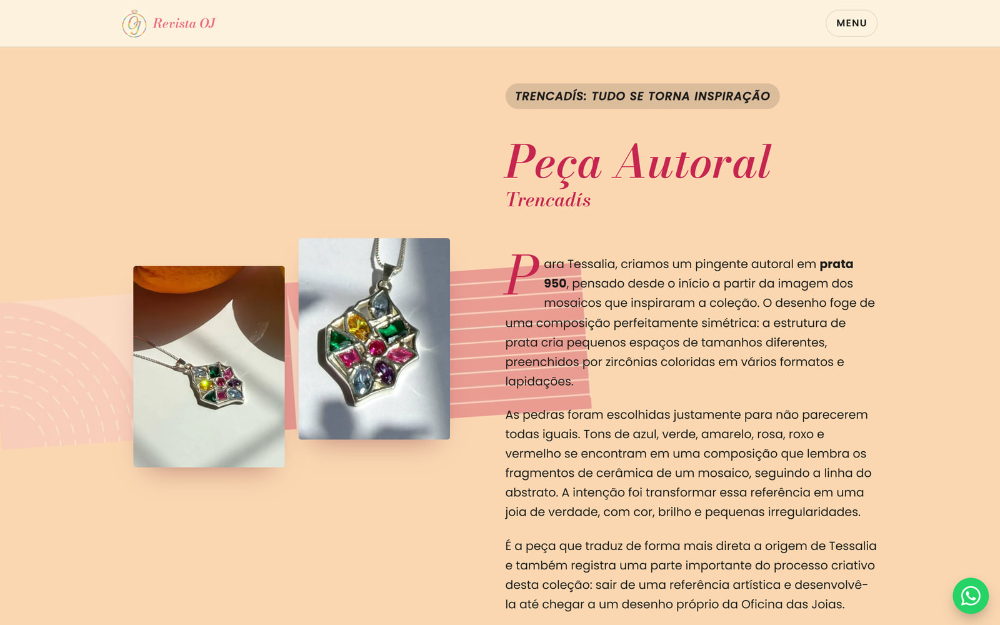
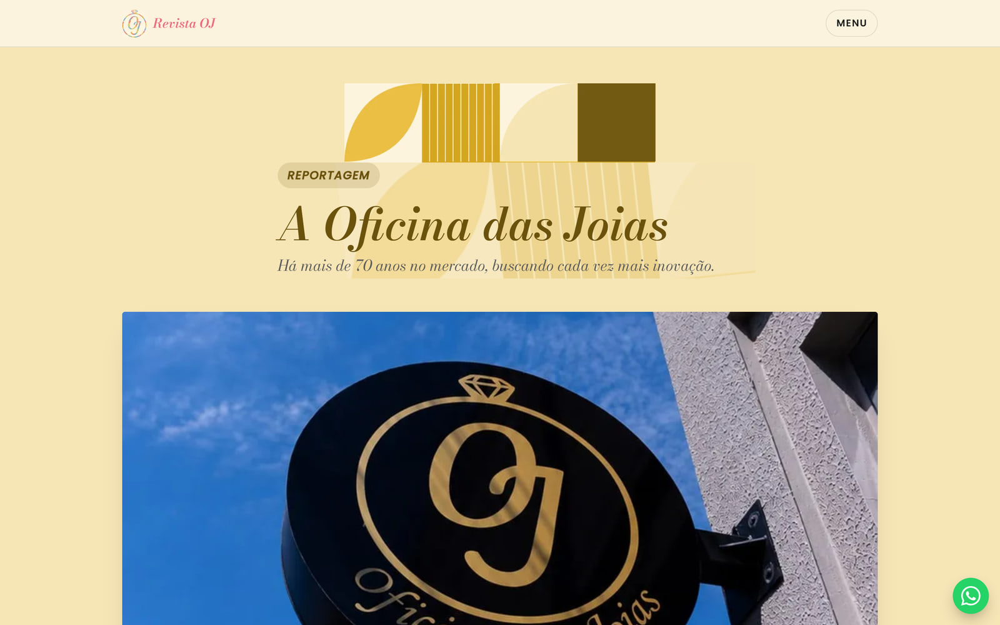
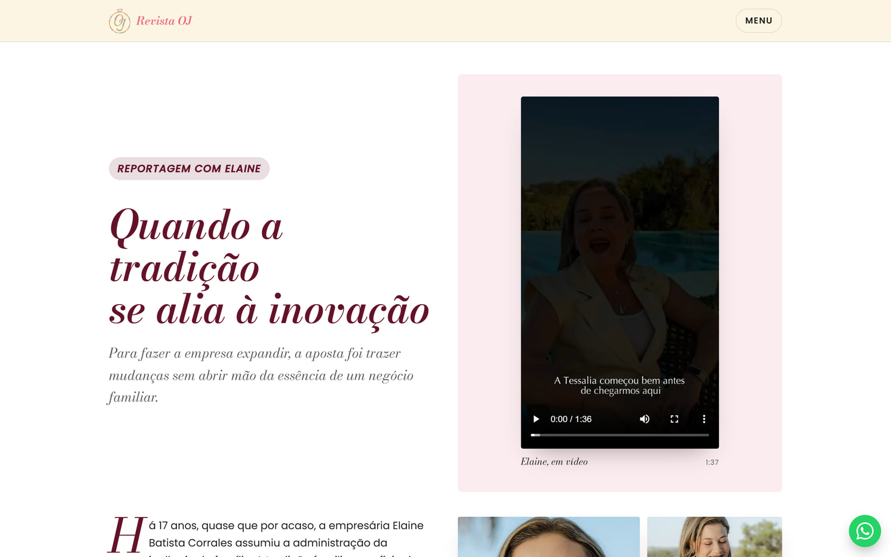
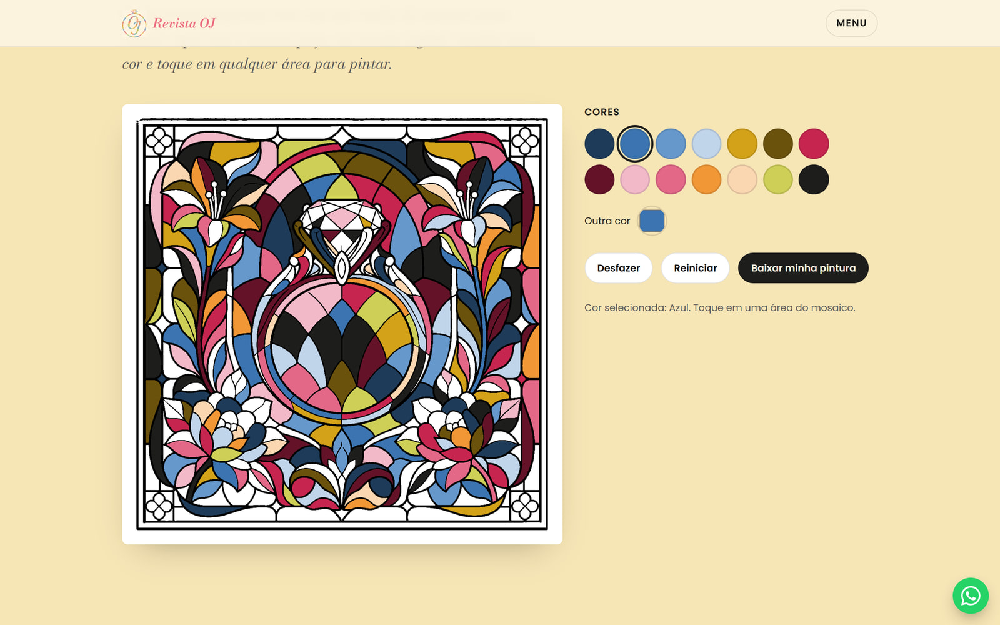
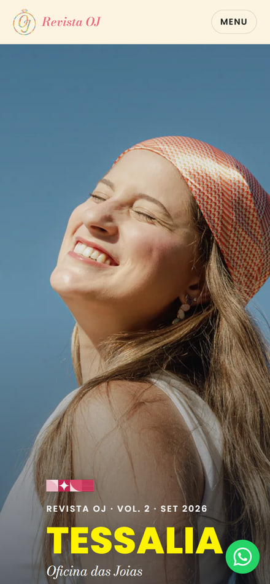
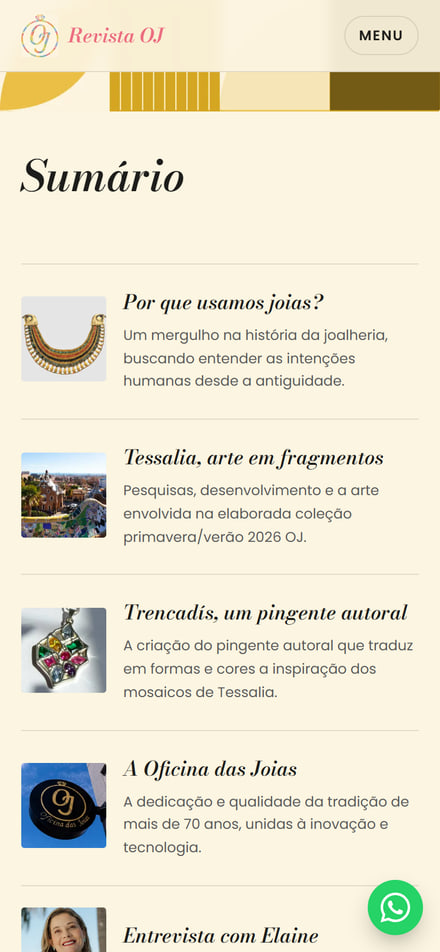

<h1 align="center">Revista OJ — Vol. 2 · Tessalia</h1>

<p align="center">
  Uma revista impressa de joalheria, reconstruída como site estático —<br>
  rolagem contínua, sem flipbook, e com o cartão de colorir da edição jogável no navegador.
</p>

<p align="center">
  
  
  
  
  
</p>



---

## O que é

A **Oficina das Joias** é uma joalheria e relojoaria com mais de 70 anos, e publica uma
revista impressa própria. Este repositório é a **Revista OJ Vol. 2 — Tessalia** em formato
web: as mesmas matérias, as mesmas fotos e a mesma identidade visual da edição impressa,
numa página única de rolagem contínua.

A revista impressa acompanha um **cartão de mosaico para colorir**. O site traz esse cartão
em versão digital, jogável — e é a peça central do projeto.

Não há CMS, banco de dados nem backend: o site é HTML estático gerado por
[Astro](https://astro.build), publicado em qualquer host de arquivos.

## Destaques técnicos

| | |
|---|---|
| **~5 KB de JavaScript no total** | Três scripts inline, nenhum arquivo `.js` externo. Sem framework de UI, sem hidratação. |
| **Zero bibliotecas no navegador** | Astro e `sharp` só rodam no build; do `@fontsource` chegam só os arquivos de fonte. Nenhum JS de terceiros. |
| **Jogo de colorir em canvas puro** | Flood fill por varredura de linhas escrito à mão em TypeScript, sem biblioteca. |
| **Design extraído do PDF, não recriado** | Fontes lidas dos metadados do PDF; cores amostradas dos pixels reais das artes. |
| **CSP estrita com hashes automáticos** | O Astro calcula o hash de cada script a cada build — a política nunca sai de sincronia. |
| **Fontes self-hosted** | `@fontsource`, sem chamada ao Google Fonts. Nenhuma requisição sai do domínio. |
| **272 variantes de imagem geradas no build** | WebP responsivos a partir de 65 fotos, via pipeline de imagem do Astro. |

## O site

<table>
  <tr>
    <td width="50%"><br><sub><b>Sumário</b> — cada capítulo com sua miniatura</sub></td>
    <td width="50%"><br><sub><b>Por que usamos joias?</b> — matéria de abertura, em duas colunas</sub></td>
  </tr>
  <tr>
    <td><br><sub><b>Tessalia</b> — a coleção primavera/verão 2026, inspirada no <i>trencadís</i> de Gaudí</sub></td>
    <td><br><sub><b>Peça autoral</b> — o pingente Trencadís em prata 950</sub></td>
  </tr>
  <tr>
    <td><br><sub><b>A Oficina</b> — reportagem sobre a casa e o ofício</sub></td>
    <td><br><sub><b>Entrevista</b> — com vídeos servidos direto do site</sub></td>
  </tr>
</table>

Cada capítulo tem sua própria paleta, herdada da revista impressa, e é separado do
seguinte por uma faixa de mosaico *trencadís* recortada da própria diagramação original.

### Pinte o mosaico



A versão digital do cartão que acompanha a edição impressa. Escolha uma cor, toque em
qualquer área e ela é preenchida — o mesmo comportamento de um balde de tinta.

Por dentro (`src/scripts/coloring-game.ts`, ~250 linhas, sem dependências):

- **Flood fill por varredura de linhas** em vez do preenchimento ingênuo em 4 direções —
  numa tela de ~1,4 milhão de pixels a diferença é entre instantâneo e travar a aba.
- **Detecção de borda por luminância**: pixels abaixo de um limiar de luma são traço, nunca
  são preenchidos e nunca são atravessados. Clicar em cima de uma linha não faz nada.
- **A arte é limiarizada em preto/branco puro** no build (`sharp.threshold()`), e servida de
  `public/` sem passar pelo pipeline de otimização do Astro. Uma borda de JPEG suavizada
  deixaria o preenchimento "vazar" pelos cinzas intermediários da borda.
- **Desfazer** com histórico de 12 passos, e o progresso salvo em `localStorage` —
  do próprio navegador do visitante, nunca enviado a lugar nenhum.
- **Baixar minha pintura** exporta o canvas como PNG.

### No celular

<p align="left">
  
  
</p>

Layout fluido de ponta a ponta: tipografia em `clamp()`, grids que se recompõem por
`min-width`, e imagens responsivas com `sizes` declarado por componente.

## Stack

- **[Astro 7](https://astro.build)** — build estático, otimização de imagens, sitemap, CSP
- **TypeScript** em modo estrito (`astro/tsconfigs/strict`)
- **CSS puro** com custom properties em duas camadas (primitivas → semânticas)
- **[sharp](https://sharp.pixelplumbing.com)** — pipeline de imagens, só no build
- **Vercel** para hospedagem (qualquer host estático serve)

## Rodando localmente

Requer **Node.js 22.12+**.

```bash
git clone https://github.com/KevinLopes23/revista-OJ.git
cd revista-OJ
npm install

npm run dev       # http://localhost:4321
npm run build     # gera dist/
npm run preview   # serve dist/ localmente
```

O primeiro `build` gera as 272 variantes de imagem e leva alguns minutos; os seguintes
reaproveitam o cache em `.astro/` e levam segundos.

## Estrutura

```
src/
  components/     uma seção da revista por componente (Hero, HistorySection, …)
  layouts/        BaseLayout.astro — <head>, fontes, SEO, Open Graph
  scripts/        coloring-game.ts (canvas + flood fill), nav.ts (menu + scroll-spy),
                  reveal.ts (fade-in por IntersectionObserver)
  styles/         tokens.css (cores/tipografia extraídas da revista) + global.css
  assets/photos/  fotos já otimizadas (geradas por scripts/process-images.mjs)
  assets/brand/   marca Tessalia recortada da arte original
public/
  game/mosaic-lineart.png   arte do mosaico, servida byte a byte (ver acima)
  video/                    os quatro filmes da edição
scripts/
  extract-pdf.py            extrai texto e imagens dos PDFs (PyMuPDF)
  process-images.mjs        regenera src/assets/ a partir de source-material/
docs/screenshots/           as imagens deste README
source-material/            PDFs originais — fora do Git (ver abaixo)
```

## Design

Cores e tipografia **não são uma reinterpretação livre** — foram extraídas diretamente do
PDF da revista: as fontes lidas dos metadados do arquivo, as cores amostradas dos pixels
reais das artes. `src/styles/tokens.css` traz a lista completa e o raciocínio de cada token.

- **Bodoni Moda** (títulos) e **Poppins** (corpo) — as mesmas fontes da revista, hospedadas
  localmente via `@fontsource`.
- A revista usa uma terceira fonte, **Seenonim**, só na palavra "TESSALIA". Não é uma fonte
  web licenciada disponível, então o site usa Poppins ExtraBold com tracking largo como
  substituta (`--font-wordmark`). Se a licença aparecer, é só trocar esse token.

## Segurança

Não existe formulário, sessão, cookie ou backend — os contatos são links `tel:`, `wa.me` e
Instagram diretos. Não há superfície de ataque de servidor porque não há servidor. O que
sobra é endurecido:

- **CSP estrita** (`astro.config.mjs` → `security.csp`): o Astro calcula o hash dos scripts
  que ele mesmo empacota a cada build, então a política fica sempre correta sem manutenção
  manual — sem `'unsafe-inline'`.
- **Cabeçalhos** que um `<meta>` de CSP não consegue expressar (`X-Frame-Options`,
  `Referrer-Policy`, `Permissions-Policy`, HSTS) ficam em `vercel.json`.
- **Fontes self-hosted**: nenhuma requisição a `fonts.googleapis.com`.
- O jogo roda inteiramente no navegador; o progresso fica só no `localStorage` do visitante.

## Regenerando as imagens

Os PDFs originais (a revista tem ~170 MB) excedem o limite de 100 MB por arquivo do GitHub
e não são necessários para rodar ou publicar o site — só para regenerar as imagens. Por
isso `source-material/` é ignorado pelo Git; guarde os PDFs localmente ou num Drive
compartilhado com a cliente.

Se precisar reprocessar (nova edição, fotos trocadas):

1. Coloque os PDFs em `source-material/` com os mesmos nomes de arquivo.
2. Rode a extração (Python + PyMuPDF — tira texto e todas as fotos do PDF):
   ```bash
   pip install pymupdf
   python scripts/extract-pdf.py
   ```
   Isso gera `source-material/extraction/` com o texto de cada página
   (`text/pages_raw.json`) e todas as imagens embutidas.
3. Escolha à mão, nos arrays `PHOTOS`/`STRIPS` de `scripts/process-images.mjs`, quais das
   imagens extraídas entram no site — a extração traz *todas* as fotos do PDF, bem mais
   do que cabe numa página de rolagem contínua.
4. Rode `npm run process-images`. Isso regenera `src/assets/photos/`, `src/assets/brand/`,
   `public/game/mosaic-lineart.png`, os favicons e a imagem de compartilhamento
   (`public/og-cover.jpg`).

O script sai limpo se `source-material/` não estiver presente (num clone novo, por
exemplo) — os arquivos já commitados em `src/assets/` são os que valem.

## Deploy

1. Importe o repositório em [vercel.com](https://vercel.com) → *Add New Project*. O
   framework Astro é detectado automaticamente; não é preciso configurar nada.
2. Em **Settings → Domains**, adicione o domínio `.com.br` da marca e siga as instruções
   de DNS que a Vercel mostrar.
3. Atualize `site:` em `astro.config.mjs` e `Sitemap:` em `public/robots.txt` para o
   domínio final — isso ajusta as URLs do sitemap e as tags Open Graph.

Cada `git push` para `main` publica uma nova versão. Não há painel administrativo porque
não há necessidade: o conteúdo é editado direto nos componentes em `src/components/`.

## Licença

O **código** deste repositório está sob a [Licença MIT](LICENSE).

O **conteúdo editorial** — fotografias, textos das matérias, a arte do mosaico, a marca e a
identidade visual da Revista OJ e da Oficina das Joias — **não** está coberto pela MIT e
permanece propriedade da Oficina das Joias. Use o código à vontade; as fotos e os textos,
não.
